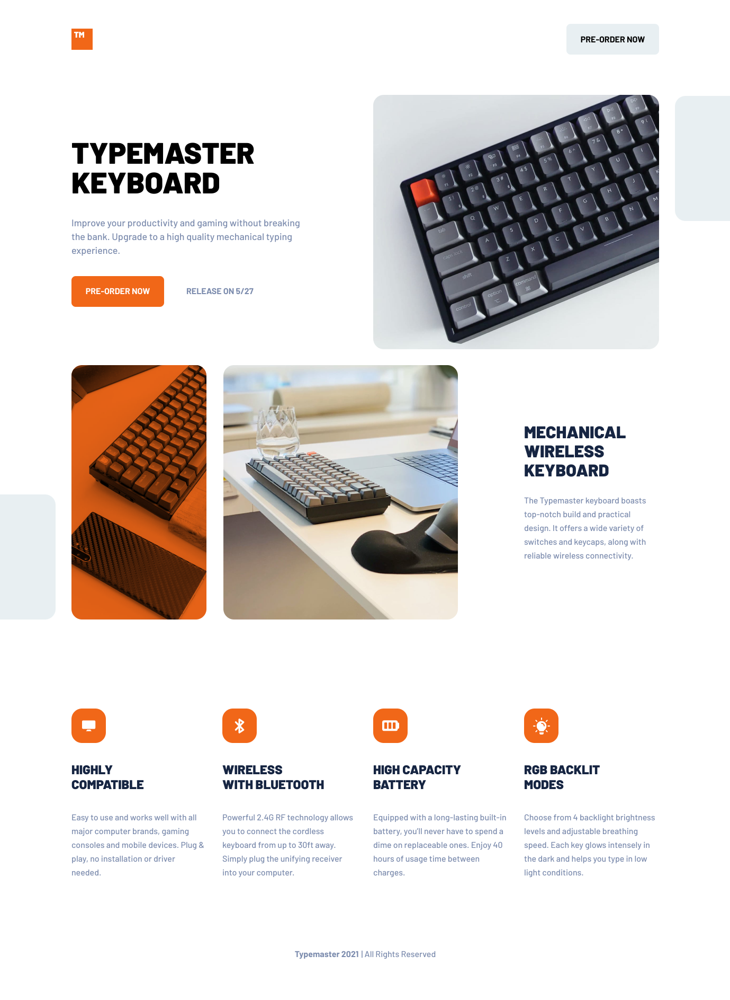

# Typemaster pre-launch landing page solution

This is a solution to the [Typemaster pre-launch landing page challenge on Frontend Mentor](https://www.frontendmentor.io/challenges/typemaster-prelaunch-landing-page-J6-Yj5J-X/hub/typemaster-prelaunch-landing-page-UUG1Zfe1Ng). 

## Table of contents

  - [Overview](#overview)
    - [Screenshot](#screenshot)
    - [Links](#links)
    - [Built with](#built-with)
    - [What I learned](#what-i-learned)
    - [Continued development](#continued-development)
  - [Author](#author)

## Overview

### The challenge

A responsive landing page created using HTML and CSS.

### Screenshot

### Links

- Solution URL: [https://github.com/mhjarvis/frontend-mentor-projects/tree/main/junior_solutions/typemaster_prelaunch](https://github.com/mhjarvis/frontend-mentor-projects/tree/main/junior_solutions/typemaster_prelaunch)
- Live Site URL: [https://mhjarvis-typemaster-prelaunch.netlify.app/](https://mhjarvis-typemaster-prelaunch.netlify.app/)

### Built with

- Semantic HTML5 markup
- CSS custom properties
- Flexbox
- CSS Grid

### What I learned

I tried to build something a little more complex and attempted to use CSS Grid. I got more comfortable using the <picture> element, though it still felt bloated. 

## Author

- Frontend Mentor - [@mhjarvis](https://www.frontendmentor.io/profile/mhjarvis)
- GitHub - [@mhjarvis](https://github.com/mhjarvis)