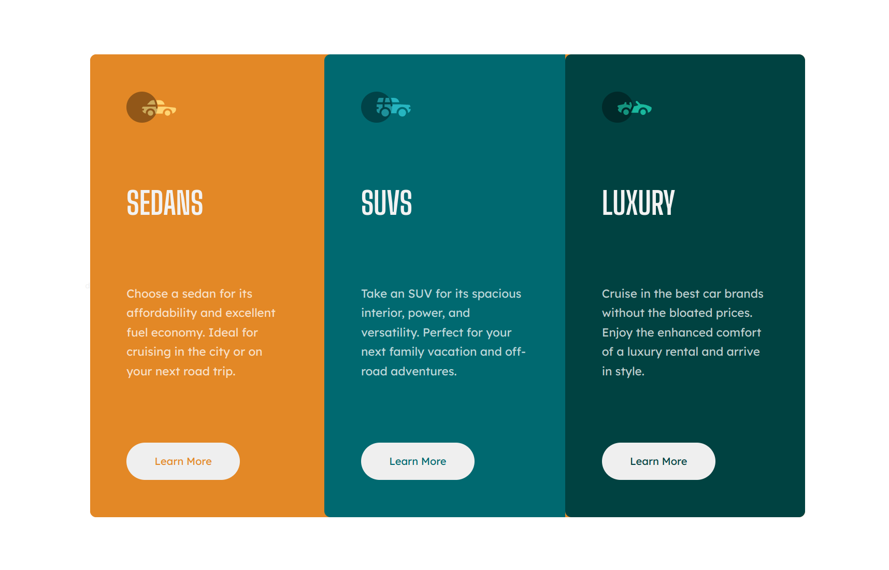

# Frontend Mentor - 3-column preview card component solution

This is a solution to the [3-column preview card component challenge on Frontend Mentor](https://www.frontendmentor.io/challenges/3column-preview-card-component-pH92eAR2-).

## Table of contents

  - [Overview](#overview)
    - [Screenshot](#screenshot)
    - [Links](#links)
    - [Built with](#built-with)
    - [Continued development](#continued-development)
  - [Author](#author)

## Overview

### The challenge

A responive component built with HTML and CSS.

### Screenshot

### Links

- Solution URL: [https://github.com/mhjarvis/frontend-mentor-projects/tree/main/newbie_solutions/3-column-preview-card-component-main](https://github.com/mhjarvis/frontend-mentor-projects/tree/main/newbie_solutions/3-column-preview-card-component-main)
- Live Site URL: [https://mhjarvis-3-column-preview-card.netlify.app/](https://mhjarvis-3-column-preview-card.netlify.app/)

### Built with

- Semantic HTML5 markup
- CSS custom properties
- Flexbox

## Author

- Frontend Mentor - [@mhjarvis](https://www.frontendmentor.io/profile/mhjarvis)
- GitHub - [@mhjarvis](https://github.com/mhjarvis)