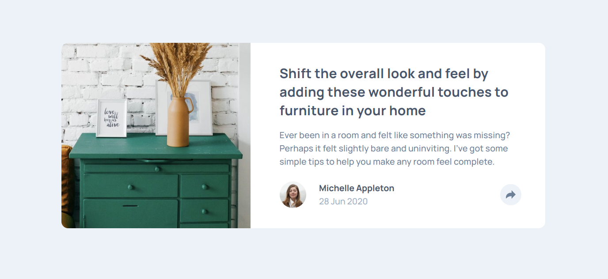

# Frontend Mentor - Article preview component solution

This is a solution to the [Article preview component challenge on Frontend Mentor](https://www.frontendmentor.io/challenges/article-preview-component-dYBN_pYFT).

## Table of contents

  - [Overview](#overview)
    - [Screenshot](#screenshot)
    - [Links](#links)
    - [Built with](#built-with)
    - [What I learned](#what-i-learned)
  - [Author](#author)

## Overview

### The challenge

A preview card built with HTML, CSS, and JavaScript that is responsive.

### Screenshot

### Links

- Solution URL: [https://github.com/mhjarvis/frontend-mentor-projects/tree/main/newbie_solutions/article-preview-component-master](https://github.com/mhjarvis/frontend-mentor-projects/tree/main/newbie_solutions/article-preview-component-master)
- Live Site URL: [https://mhjarvis-article-component.netlify.app/](https://mhjarvis-article-component.netlify.app/)

### Built with

- Semantic HTML5 markup
- CSS custom properties
- Flexbox

## Author

- Frontend Mentor - [@mhjarvis](https://www.frontendmentor.io/profile/mhjarvis)
- GitHub - [@mhjarvis](https://github.com/mhjarvis)