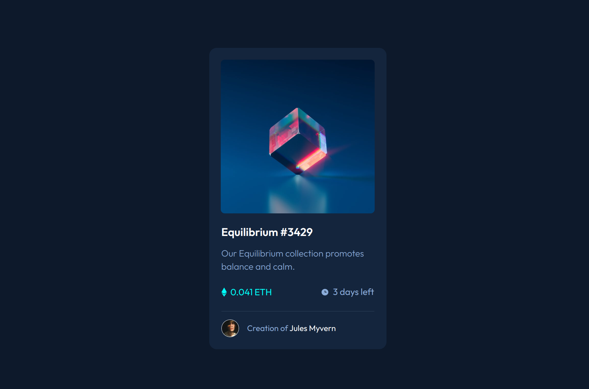

# Frontend Mentor - NFT preview card component solution

This is a solution to the [NFT preview card component challenge on Frontend Mentor](https://www.frontendmentor.io/challenges/nft-preview-card-component-SbdUL_w0U). 

## Table of contents

  - [Overview](#overview)
    - [Screenshot](#screenshot)
    - [Links](#links)
    - [Built with](#built-with)
    - [What I learned](#what-i-learned)
  - [Author](#author)

## Overview

### The challenge

A responive card component built with HTML and CSS.

### Screenshot



### Links

- Solution URL: [https://github.com/mhjarvis/frontend-mentor-projects/tree/main/newbie_solutions/nft-preview-card-component-main](https://github.com/mhjarvis/frontend-mentor-projects/tree/main/newbie_solutions/nft-preview-card-component-main)
- Live Site URL: [https://mhjarvis-nft-preview-card.netlify.app/](https://mhjarvis-nft-preview-card.netlify.app/)

## My process

### Built with

- Semantic HTML5 markup
- CSS custom properties
- Flexbox

### What I learned

The main thing I learned was a method for adding a colored layer on top of a picture which was achieved using the pseudo-element ```::after```. 

## Author

- Frontend Mentor - [@mhjarvis](https://www.frontendmentor.io/profile/mhjarvis)
- GitHub - [@mhjarvis](https://github.com/mhjarvis)